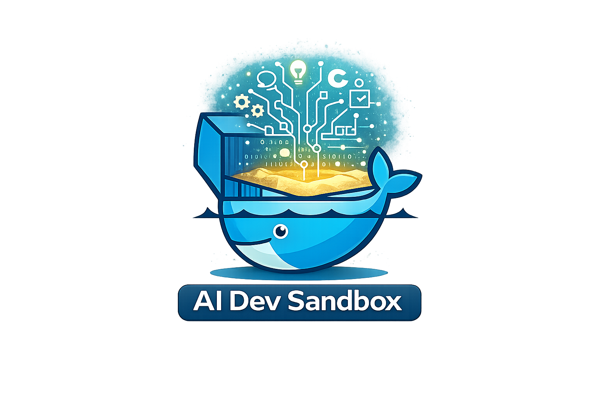
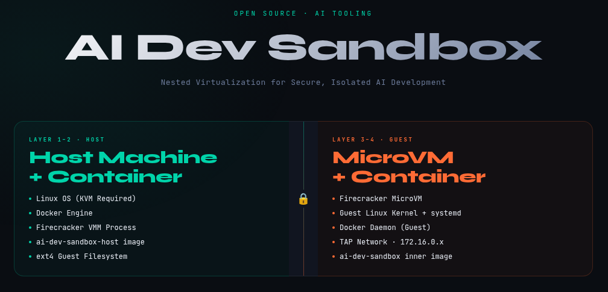

<div style="text-align: center;">
  <p>amd64✅ - arm64⚠️</p>
  <p><a href="https://deepwiki.com/BechtelCanDoIt/ai-dev-sandbox"></a></p>
</div>

---

# AI-Dev-Sandbox

AI terminal development environment running inside a **Firecracker MicroVM** to protect the host system.

<div style="text-align: center;">
  <p></p>
</div>

## Marketing Flyer

<div style="text-align: center;">
  <p><a href="marketing/index.html"></a></p>
</div>

## Architecture

```
Your machine
  └── Docker: AI-Dev-Sandbox-Host              ← Firecracker VMM container (HOST layer)
        └── Firecracker MicroVM                ← Hardware-isolated guest Linux
              ├── systemd
              ├── Docker daemon
              ├── load-ai-dev-sandbox.service  ← loads pre-baked image on first boot
              └── ai-dev-sandbox:latest        ← WHERE YOU WORK  (INNER layer)
                    ├── Claude Code  (claude)
                    ├── OpenCode     (opencode)
                    ├── ChatGPT CLI  (chatgpt)
                    ├── Gemini CLI   (gemini)
                    ├── GitHub CLI   (gh)
                    ├── Git CLI      (git)
                    ├── Go 1.22, Python 3, Rust 1.75, Node.js
                    └── Voice: Whisper STT + Piper TTS (gracefully optional) <--- This is a work in progress
```

Your host workspace (`./workspace/`) is shared into the VM at `/workspace`, and from there into the AI-Dev-Sandbox container at `/workspace`.

## Prerequisites

1. Linux host with KVM enabled — see `TURNONKVM.md` in `BechtelCanDoIt/firecracker-base` project
2. Docker with BuildKit

## Build

```bash
cp .env.template .env
# Fill in your API keys in .env

./ai build
```

Build steps (automated by ai cli calling `build.sh`):
1. `docker build` — inner `ai-dev-sandbox:latest` image
2. `docker save` — exports it to `.build/ai-dev-sandbox.tar`
3. Extracts `base.ext4` from `firecracker-base:latest`
4. Resizes + patches it → `.build/ai-dev-sandbox.ext4`
   - Pre-bakes `ai-dev-sandbox.tar` into the rootfs
   - Installs `load-ai-dev-sandbox.service` (loads image on first guest boot)
   - Patches `sandbox` user's `.bash_profile` to auto-launch the container
5. `docker build` — host `ai-dev-sandbox-host:latest` image (embeds `ai-dev-sandbox.ext4`)

### Incremental builds

```bash
./ai build inner-only    # Rebuild just the inner image (iterating on tools/scripts)
./ai build inject-only   # Re-run rootfs injection only
./ai build host-only     # Rebuild just the host image
./ai build clean         # Full clean rebuild
```

## Run

```bash
./ai
```

What happens:
1. Host entrypoint writes your API keys to `/workspace/.sandbox.env`
2. Firecracker boots the MicroVM (guest Linux from `ai-dev-sandbox.ext4`)
3. Guest `systemd` starts Docker + `load-ai-dev-sandbox.service`
4. On **first boot**: Docker loads `ai-dev-sandbox:latest` from the pre-baked tar (~2 min)
5. `agetty` autologs in as `sandbox`, `.bash_profile` runs `docker run -it ai-dev-sandbox:latest`
6. You're dropped into the AI-Dev-Sandbox shell

On subsequent boots, step 4 is skipped (marker file persists in the rootfs).

## Environment Variables

Set in `.env` (copied from `.env.template`):

| Variable | Default | Description |
|---|---|---|
| `FC_VCPU` | `8` | MicroVM vCPUs |
| `FC_MEM` | `8192` | MicroVM RAM (MB) |
| `FC_WORKSPACE_SIZE` | `4096` | Workspace disk (MB) |
| `ANTHROPIC_API_KEY` | | Claude API key |
| `OPENAI_API_KEY` | | OpenAI API key |
| `GOOGLE_API_KEY` | | Google/Gemini key |
| `GITHUB_TOKEN` | | GitHub token |
| `OLLAMA_HOST` | `http://172.16.0.1:11434` | Ollama URL (172.16.0.1 = your host) |

## Inside the sandbox

```bash
# AI Tools (installed on first startup, cached after that)
claude          # Claude Code
opencode        # OpenCode
gemini          # Gemini CLI
chatgpt         # ChatGPT CLI

# Utilities
gh              # GitHub CLI
git             # source control

# Languages
go version      # Go 
python3         # Python 3
rustc --version # Rust 
node --version  # Node.js

# Workspace
ls /workspace   # Your files
```

## Security

The MicroVM provides hardware-level isolation:
- Separate kernel (guest kernel in vm hardware space, not host kernel)
- Hardware memory isolation (Intel EPT / AMD NPT)
- Minimal VMM attack surface (Firecracker ~50k LoC)

The AI-Dev-Sandbox container inside the VM is a standard Docker container — writable, not read-only — because it's already isolated by the MicroVM boundary.

---

# Build On
<div style="text-align: center;">
  <a href="https://github.com/BechtelCanDoIt/firecracker-base"></a>
</div>